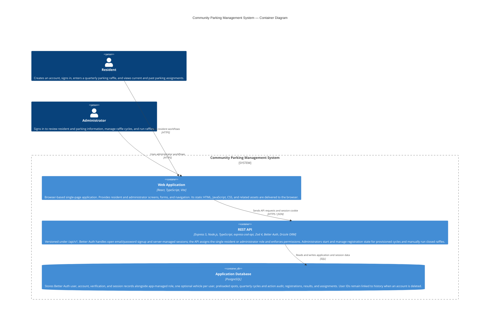

# Community Parking Management System — C4 Container Diagram

```mermaid
C4Container
  title Community Parking Management System — Container Diagram

  Person(resident, "Resident", "Creates an account, signs in, enters a quarterly parking raffle, and views current and past parking assignments.")
  Person(admin, "Administrator", "Signs in to review resident and parking information, manage raffle cycles, and run raffles.")

  System_Boundary(parking, "Community Parking Management System") {
    Container(web, "Web Application", "React, TypeScript, Vite", "Browser-based single-page application. Provides resident and administrator screens, forms, and navigation. Its static HTML, JavaScript, CSS, and related assets are delivered to the browser.")
    Container(api, "REST API", "Express 5, Node.js, TypeScript, express-zod-api, Zod 4, Better Auth, Drizzle ORM", "Versioned under /api/v1. Better Auth handles open email/password signup and server-managed sessions; the API assigns the single resident or administrator role and enforces permissions. Administrators start and manage registration state for provisioned cycles and manually run closed raffles.")
    ContainerDb(db, "Application Database", "PostgreSQL", "Stores Better Auth user, account, verification, and session records alongside app-managed role, one optional vehicle per user, preloaded spots, quarterly cycles and action audit, registrations, results, and assignments. User IDs remain linked to history when an account is deleted.")
  }

  Rel(resident, web, "Uses resident workflows", "HTTPS")
  Rel(admin, web, "Uses administrator workflows", "HTTPS")
  Rel(web, api, "Sends API requests and session cookie", "HTTPS / JSON")
  Rel(api, db, "Reads and writes application and session data", "SQL")
```
